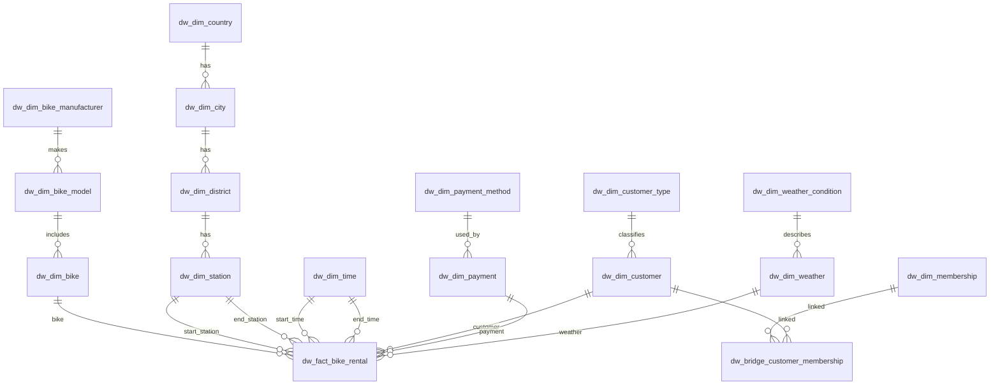
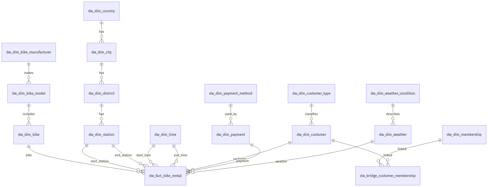

# ADT Project: Bike Rental Data Warehouse

This repository contains a star-schema style data warehouse for a bike rental platform, plus generated data, SQL*Loader control files, and analytics queries.

## What Is Included

- SQL schema DDL for dimensions, bridge table, and fact table: `ProjectADBT.sql`
- Analytics SQL (ROLLUP, CUBE, window functions, views, ranking): `queries.sql`
- Data generator script for CSV output: `data_generator.py`
- SQL*Loader control files for each table: `dw_*.ctl`
- Pre-generated CSV datasets for all tables: `dw_*.csv`
- Batch loader that loads tables in dependency-safe order: `load_all.bat`
- Helper script that can regenerate control files: `generator.py`
- SQL*Loader proof/output capture: `sql loader proof.lua`

## Data Model Summary

The warehouse includes:

- Time dimension: `dw_dim_time`
- Location hierarchy: `dw_dim_country` -> `dw_dim_city` -> `dw_dim_district` -> `dw_dim_station`
- Bike hierarchy: `dw_dim_bike_manufacturer` -> `dw_dim_bike_model` -> `dw_dim_bike`
- Customer hierarchy: `dw_dim_customer_type` -> `dw_dim_customer`
- Membership + bridge: `dw_dim_membership`, `dw_bridge_customer_membership`
- Payment dimensions: `dw_dim_payment_method`, `dw_dim_payment`
- Weather dimensions: `dw_dim_weather_condition`, `dw_dim_weather`
- Fact table: `dw_fact_bike_rental`

## ER Diagram



Static PNG fallback (for viewers that do not render Mermaid):



## Prerequisites

- Oracle Database (target schema/user)
- Oracle SQL*Plus (or equivalent SQL client)
- Oracle SQL*Loader (`sqlldr`)
- Python 3 (only needed if regenerating data/control files)

## Quick Start

### 1. Create the Warehouse Schema

Run the DDL script:

```bash
sqlplus <user>/<password>@<host>:<port>/<service> @ProjectADBT.sql
```

### 2. (Optional) Regenerate CSV Data

This project already includes CSV data. If you want fresh data:

```bash
python3 data_generator.py --delimiter ';' --rows 10000
```

Notes:

- Control files in this repo use `;` as delimiter.
- Generated CSV files do not include a header row, which matches the existing control-file setup.

### 3. Load Data with SQL*Loader

On Windows, use the included batch file:

```bat
load_all.bat
```

On Linux/macOS, run loaders in the same order as the batch file. Example pattern:

```bash
sqlldr <user>/<password>@<host>:<port>/<service> control=dw_dim_country.ctl log=dw_dim_country.log
```

The included `load_all.bat` already enforces the correct dependency order (parent dimensions first, fact table last).

## Run Analytics Queries

Execute:

```bash
sqlplus <user>/<password>@<host>:<port>/<service> @queries.sql
```

`queries.sql` includes:

- ROLLUP reports
- CUBE aggregations
- Partition/window-percentage analysis
- Reusable views
- Ranking queries

## Typical Workflow

1. Create tables with `ProjectADBT.sql`.
2. Ensure CSV and `.ctl` files are present (or regenerate them).
3. Load all tables via SQL*Loader (`load_all.bat` or manual equivalent).
4. Run `queries.sql` for OLAP/analytics outputs.

## Notes and Caveats

- `load_all.bat` currently contains hardcoded credentials/connection details; update them before use.
- If you regenerate control files with `generator.py`, verify delimiter settings before loading.
- SQL*Loader `.log` files in the repository can be used as reference for expected load outcomes.
